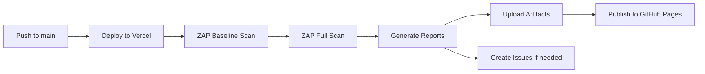

# 🛡️ OWASP ZAP DAST (Dynamic Application Security Testing)

Este proyecto incluye escaneos de seguridad automatizados usando OWASP ZAP para detectar vulnerabilidades en la aplicación desplegada.

## 📋 Tabla de Contenidos
1. [¿Qué es DAST?](#qué-es-dast)
2. [Configuración](#configuración)
3. [Tipos de Escaneo](#tipos-de-escaneo)
4. [Workflows](#workflows)
5. [Reportes](#reportes)
6. [Interpretación de Resultados](#interpretación-de-resultados)
7. [Personalización](#personalización)

---

## ¿Qué es DAST?

**Dynamic Application Security Testing (DAST)** es una técnica de prueba de seguridad que analiza aplicaciones web en ejecución para identificar vulnerabilidades de seguridad. A diferencia de SAST (análisis estático), DAST prueba la aplicación desde el exterior, simulando ataques reales.

### Ventajas de DAST con OWASP ZAP:
- ✅ Detecta vulnerabilidades en tiempo de ejecución
- ✅ No requiere acceso al código fuente
- ✅ Identifica problemas de configuración
- ✅ Simula ataques del mundo real
- ✅ Gratuito y open source

---

## Configuración

### Secrets Requeridos

Para que los escaneos funcionen correctamente, necesitas configurar:

| Secret | Descripción | Requerido |
|--------|-------------|-----------|
| `PRODUCTION_URL` | URL de tu aplicación en producción | Opcional* |

\* Si no configuras `PRODUCTION_URL`, el workflow usará la URL por defecto.

### Configurar el Secret

1. Ve a tu repositorio en GitHub
2. Navega a **Settings** → **Secrets and variables** → **Actions**
3. Click en **New repository secret**
4. Nombre: `PRODUCTION_URL`
5. Valor: Tu URL de producción (ej: `https://trading-sim-app.vercel.app`)
6. Click **Add secret**

---

## Tipos de Escaneo

### 1. Baseline Scan (Escaneo Pasivo)
- **Duración**: ~1-2 minutos
- **Método**: Pasivo (solo observa el tráfico)
- **Seguridad**: Completamente seguro para producción
- **Detecta**: 
  - Headers de seguridad faltantes
  - Configuraciones incorrectas
  - Vulnerabilidades obvias
  - Divulgación de información

### 2. Full Scan (Escaneo Activo)
- **Duración**: ~5-15 minutos
- **Método**: Activo (envía payloads de ataque)
- **Seguridad**: Puede generar tráfico significativo
- **Detecta**:
  - SQL Injection
  - Cross-Site Scripting (XSS)
  - CSRF
  - Path Traversal
  - Command Injection
  - Y más...

---

## Workflows

### Ejecución Automática

El workflow de ZAP se ejecuta automáticamente:

```yaml
# Después de cada despliegue exitoso en Vercel
on:
  workflow_run:
    workflows: ["Deploy to Vercel"]
    types: [completed]
    branches: [main]

# Semanalmente (lunes a las 2 AM UTC)
  schedule:
    - cron: '0 2 * * 1'
```

### Ejecución Manual

Puedes ejecutar los escaneos manualmente:

1. Ve a **Actions** en tu repositorio
2. Selecciona **OWASP ZAP DAST Security Scan**
3. Click en **Run workflow**
4. (Opcional) Ingresa una URL personalizada
5. Click **Run workflow**

---

## Reportes

### Formatos Disponibles

Los escaneos generan múltiples formatos de reporte:

#### HTML Report
- Visualización completa con gráficos
- Navegable por navegador web
- Incluye detalles de cada vulnerabilidad
- **Ubicación**: `zap-reports/zap-*-report.html`

#### Markdown Report
- Formato legible en GitHub
- Ideal para revisiones rápidas
- Se puede incluir en issues automáticamente
- **Ubicación**: `zap-reports/zap-*-report.md`

#### JSON Report
- Formato estructurado
- Para procesamiento automatizado
- Integración con otras herramientas
- **Ubicación**: `zap-reports/zap-*-report.json`

### Acceder a los Reportes

#### En GitHub Actions:
1. Ve al workflow run completado
2. Scroll hasta **Artifacts**
3. Descarga:
   - `zap-baseline-report`
   - `zap-full-report`
   - `zap-summary`

#### En GitHub Pages:
Visita: `https://<tu-usuario>.github.io/<tu-repo>/zap/`

---

## Interpretación de Resultados

### Niveles de Severidad

| Nivel | Color | Acción Recomendada |
|-------|-------|-------------------|
| **High** 🔴 | Rojo | Corregir inmediatamente |
| **Medium** 🟡 | Amarillo | Corregir pronto |
| **Low** 🟢 | Verde | Revisar cuando sea posible |
| **Informational** ℹ️ | Azul | Solo para información |

### Vulnerabilidades Comunes

#### 1. Missing Security Headers
**Severidad**: Low - Medium  
**Solución**: Configurar headers en `next.config.ts`

```typescript
// next.config.ts
const nextConfig = {
  async headers() {
    return [
      {
        source: '/:path*',
        headers: [
          {
            key: 'X-Frame-Options',
            value: 'DENY',
          },
          {
            key: 'X-Content-Type-Options',
            value: 'nosniff',
          },
          {
            key: 'Referrer-Policy',
            value: 'origin-when-cross-origin',
          },
          {
            key: 'Permissions-Policy',
            value: 'camera=(), microphone=(), geolocation=()',
          },
        ],
      },
    ];
  },
};
```

#### 2. Content Security Policy (CSP)
**Severidad**: Medium  
**Solución**: Agregar CSP header

```typescript
{
  key: 'Content-Security-Policy',
  value: "default-src 'self'; script-src 'self' 'unsafe-inline' 'unsafe-eval'; style-src 'self' 'unsafe-inline';",
}
```

#### 3. Cookie Security
**Severidad**: Medium  
**Solución**: Configurar cookies con flags seguros

```javascript
// Ejemplo en API route
res.setHeader('Set-Cookie', [
  'sessionId=value; HttpOnly; Secure; SameSite=Strict'
]);
```

---

## Personalización

### Configurar Reglas de Escaneo

Puedes personalizar qué vulnerabilidades escanear en `.zap/rules.tsv`:

```tsv
# Format: ID	THRESHOLD	[INSTANCE_IDS]
# THRESHOLD: OFF, LOW, MEDIUM, HIGH

# Ejemplo: Desactivar una regla específica
10038	OFF

# Ejemplo: Hacer una regla más estricta
40018	HIGH

# Ejemplo: Reducir falsos positivos
10020	LOW
```

### IDs de Reglas Comunes

| ID | Vulnerabilidad |
|----|----------------|
| 10038 | Content Security Policy |
| 10020 | X-Frame-Options |
| 10021 | X-Content-Type-Options |
| 10010 | Cookie No HttpOnly Flag |
| 40018 | SQL Injection |
| 40012 | Cross Site Scripting (XSS) |
| 10202 | Anti-CSRF Tokens |

### Excluir URLs del Escaneo

Puedes crear un archivo `.zap/context.xml` para excluir ciertas URLs:

```xml
<?xml version="1.0" encoding="UTF-8" standalone="no"?>
<configuration>
    <context>
        <name>Default Context</name>
        <excludeFromContext>
            <pattern>.*logout.*</pattern>
            <pattern>.*\/admin\/.*</pattern>
        </excludeFromContext>
    </context>
</configuration>
```

---

## Integración con GitHub Issues

Los resultados se pueden publicar automáticamente como issues:

```yaml
- name: OWASP ZAP Scan
  uses: zaproxy/action-baseline@v0.12.0
  with:
    target: ${{ steps.set-url.outputs.target_url }}
    allow_issue_writing: true
    issue_title: 'OWASP ZAP Security Scan Results'
```

---

## Mejores Prácticas

### 1. Revisar Regularmente
- ✅ Ejecuta escaneos después de cada despliegue
- ✅ Revisa los reportes semanalmente
- ✅ Mantén un registro de vulnerabilidades corregidas

### 2. Priorizar Correcciones
1. **High**: Corregir inmediatamente
2. **Medium**: Corregir en la próxima iteración
3. **Low**: Planificar para futuras versiones

### 3. Automatización
- ✅ Integra ZAP en tu pipeline CI/CD
- ✅ Falla builds si hay vulnerabilidades críticas
- ✅ Automatiza la creación de issues

### 4. Documentación
- ✅ Documenta vulnerabilidades conocidas
- ✅ Registra excepciones justificadas
- ✅ Mantén actualizada la configuración

---

## Recursos Adicionales

### Documentación Oficial
- [OWASP ZAP](https://www.zaproxy.org/)
- [ZAP GitHub Actions](https://github.com/zaproxy/action-baseline)
- [OWASP Top 10](https://owasp.org/www-project-top-ten/)

### Herramientas Relacionadas
- **SAST**: SonarCloud (ya configurado)
- **IAST**: Contrast Security
- **Dependency Scanning**: Dependabot (GitHub)

### Tutoriales
- [ZAP Getting Started](https://www.zaproxy.org/getting-started/)
- [ZAP Automation](https://www.zaproxy.org/docs/automate/)
- [Security Headers Guide](https://securityheaders.com/)

---

## Troubleshooting

### El escaneo falla con timeout
**Solución**: Aumenta el tiempo de espera o escanea secciones específicas

### Demasiados falsos positivos
**Solución**: Ajusta los niveles en `.zap/rules.tsv`

### No se encuentran vulnerabilidades
**Solución**: Verifica que la URL sea accesible y que la app esté desplegada

---

## Ejemplo de Flujo de Trabajo



---

## Mantenimiento

### Actualizar ZAP
Las acciones de GitHub se actualizan automáticamente. Para usar una versión específica:

```yaml
uses: zaproxy/action-baseline@v0.12.0  # Pin a specific version
```

### Revisar Configuración
- ✅ Revisa `.zap/rules.tsv` trimestralmente
- ✅ Actualiza reglas según nuevas vulnerabilidades
- ✅ Ajusta umbrales según tu tolerancia al riesgo

---

## Contacto y Soporte

Si encuentras problemas o tienes sugerencias:
- Abre un issue en el repositorio
- Consulta la documentación de OWASP ZAP
- Revisa los logs del workflow en GitHub Actions

---

**Última actualización**: Diciembre 2025
